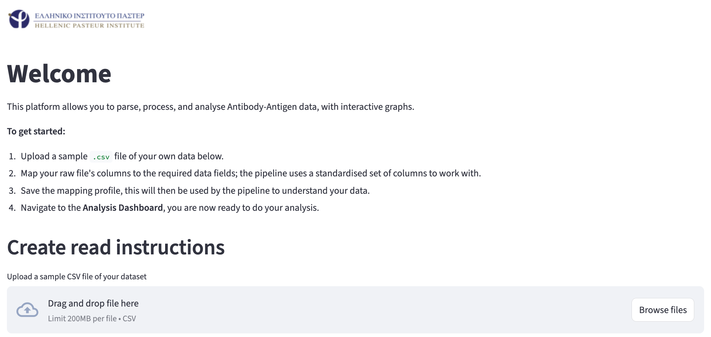
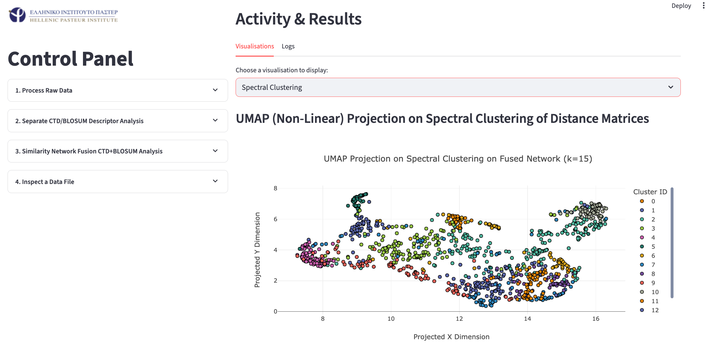
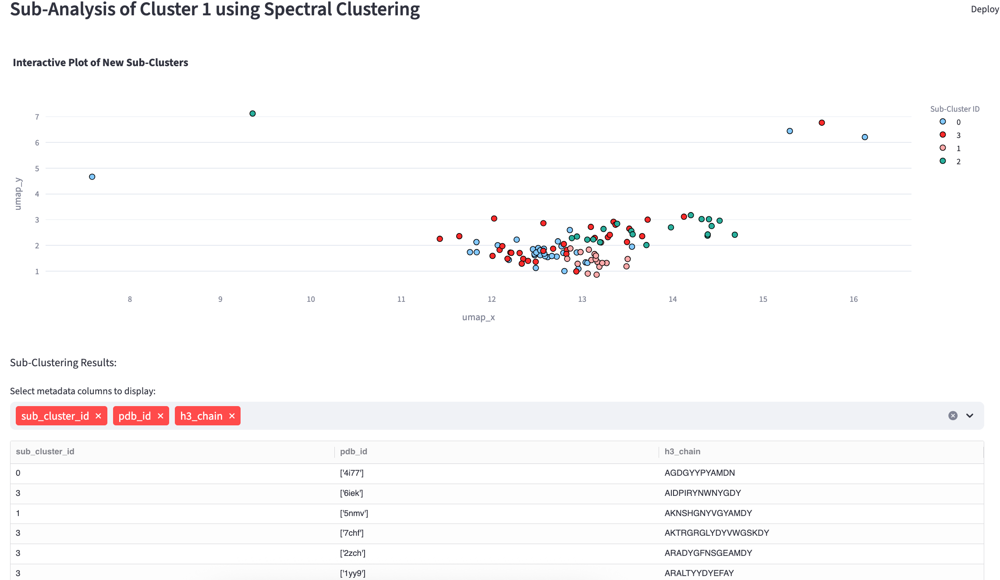

# Pasteur_Internship

## Introduction

The main scope of my internship at the Hellenic Pasteur Institute involved analysing the polyreactive behaviour of Natural Antibodies (NAbs), in order to ascertain the mechanisms of epitopic valency through a combination of Amino Acid (AA) and biophysical descriptors. Publicly available NAb **CDR3H loop** and corresponding antigenic **epitope** sequence data were collected to compute their AA sequence biophysical descriptors (i.e. Natural Antibody Database). Sequence and biophysical descriptor data were then used in protracted clustering analysis, automated by the platform. Following multiple tests and modifications, a final design was decided upon with platform able to:

- Compute Composition Transition and Distribution (CTD) statistics on each protein sequence received; mimicing LISA statistics but providing further morphological and AA composition context.
- Automate BLOSUM45 pairwise comparison between sequences.
- Identify O and N glycosylation sites, through regular expression formulae and small optimised algorithms.
- Parse foreign `csv` formats, merge to internal storage system, update database with computed statistics / metadata on all NAbs.
- Merge pairwise CTD and BLOSUM45 comparisons between NAb sequences using Similarity Network Fusion. 
- Perform HDBSCAN and Spectral Clustering; hyperparameters (i.e. cluster size) are chosen by the user. 
- Prints interactive graphs following clustering analysis, print operation logs easily accesible by the user.

The purpose of this design is to enable a user to use known NAb - to antigen -  sequence / metadata records and observe how **incomplete NAb records** (no specific antigen / lacking antigen metadata) cluster alongside the known examples. Done so, through mathematically inferred affinity between NAb's, the aim is to draw conclusions on unknown NAb valencies and with additional statistical tests, figure out the most influential determinants in NAb valency. 

# Pipeline GUI

### Welcome Page
On the welcome page, you are greeted with a request to upload an example `.csv` (ex. protein sequences with some metadata of your project), this example is scanned by the system which then provides you a list of data columns that you can include in your analysis. Importantly, to save time and effort for the user, instead of formatting your `.csv` file to match the style used by the platform's backend, your selections on the dropdown list will send instructions to the system on how to parse your project's `.csv` files.

### Analysis Page (Main)

Navigating the platform from the sidebar on the left, you can select the "*Clustering Analysis*" to show the central analysis page. On this page you have dropdown blocks, on which you can:

- **Process Raw Data**: Offers the user to designate their folder / directory where their project `.csv` files are stored, for the system to access and process automatically once the user commences analysis by clicking "*Execute Pipeline*". 
    - Note that the system can detect reruns, if the user introduces new files to their directory, select the "Rerun" option.
- **Separate CTD/BLOSUM Descriptor Analysis**: Compare and contrast the capabilities of BLOSUM based pairwise comparison between your NAbs and the CTD strategy developed for this project. You can perform a PROCRUSTES comparison between CTD and BLOSUM networks, as well as a Mantel test - comparing the separate CTD and BLOSUM affinity matrices.
- **Similarity Network Fusion CTD+BLOSUM Analysis**: Compute CTD and BLOSUM NAb affinity matrices - fuse into a singular affinity matrix through Similar Network Fusion - project into space with UMAP. Finally, the user can select to perform clustering with HDBSCAN and/or Spectral methods; this process can be repeated as many times as needed, while the user tunes their hyperparameters. Note: Interactive graphs will appear on the right, a dropdown list enables switching between all generated graphs.
- **Inspect a Data File**: Upload a `.csv` and observe contents (no write permisions). Meant as a faster alternative to Excel based `.csv` viewers.

A zoomed out example of the GUI platform parked at this page. 

### Sub-clustering Page

On this page you are greeted with a zoomed in version of the clustered (interactive) graphs you generated in the analysis page. A drop down list lets you choose between displaying either Spectral or HDBSCAN clustering results. Scrolling down, you are given the option of selecting specific clusters of interest and clustering them alone, using either algorithms offered before (more options are aimed to be implemented). Once sub-clusters are generated, a new interactive graph appears and you get given the option to scroll through a records list below the graph, where you are given the option to select what metadata you want to display for each point in the graph. As such, you can cross-reference points on the graph with complete metadata records for each point.

# Pipeline CLI (Under development)

Designed to be used in a server environment, the CLI version is an argsparse based alternative to the GUI version which wraps the Object-Oriented backend much the same. Although some features are kept absent (i.e. data visualisation, CTD-BLOSUM statistic comparison) due to a lack of time to implement them / debugging.

Issue commands with the following logic (UNIX):

`python pipeline_cli [option] --{argument} \path`

Observe the figure below for a detailed explanation of the pipeline's capabilities and inner-workings:

# Overcoming Challenges: Note to the reader

Initially, the CLI interface was developed to faithfully reproduce the project's experimentation process, by automating data parsing, performing biophysical descriptor computations, data storage, SQL data injection and linking to the ML models tested. 

The data generated by the CLI platform were used to train machine learning models - aimed to predict the relationship between an antibody's characteristics and those of a corresponding antigen. Initial modelling experiments involved a `Multi-Layer Perceptron` with two hidden layers of 100 neurons each, using a `Leaky ReLU` activation function, and a linear activation function for the output layer. Further testing was conducted with a stacked regression model, combinining a `HistGradientBoostingRegressor` and `RidgeCV` as base estimators, with a final `RidgeCV` model working as a meta-regressor, aimed at learning how to impute antigenic sequence/biophysical descriptors from just antibody data. Additional tests with non-parametric models were attempted, but none could achieve a similar training ability (accounting for overfitting), such as the stacked regressor explained prior.

As it later became clear, the scarcity of publicly available data unreservedly hindered ML model training; with efforts to identify an optimal model that can handle learning from a dataset size of 1.2k records, proving futile. As such, any further experimentation was stopped, prompting for the project's methodology to be changed such that: the data processing pipeline becomes a centre point of development, not only automating every step of data preprocessing but also tackling data analysis itself (i.e. replacing standalone ML approaches). 

**Therefore, the objective shifted from imputing epitopes with high specificty, to a more pragmatic approach which seeks to approximate antibody epitopes through clustering techniques, overcoming the issue of restricted data availability, but accompanied with its own limitations.**

# Influential References

Aggarwal, C. C., Hinneburg, A., and Keim, D. A. (2001) On the Surprising Behavior of Distance Metrics in High Dimensional Space. Database Theory — ICDT 2001 1973: 420–434.

Govindan, G., and Nair, A. S. (2011) Composition, Transition and Distribution (CTD) — A dynamic feature for predictions based on hierarchical structure of cellular sorting. 2011 Annual IEEE India Conference : 1–6. doi:https://doi.org/10.1109/indcon.2011.6139332.

Milena Vujović, Paolo Marcatili, Chain, B., Kaplinsky, J., and Thomas Lars Andresen (2023) Signatures of T cell immunity revealed using sequence similarity with TCRDivER algorithm. Communications Biology 6(1).

Zheng, X., Wang, Y., Tian, K., Zhou, J., Guan, J., Luo, L., and Zhou, S. (2017) Fusing multiple protein-protein similarity networks to effectively predict lncRNA-protein interactions. BMC Bioinformatics 18(S12).