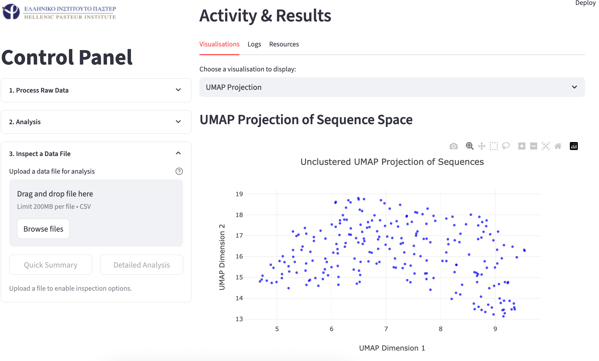

# Pasteur_Internship

## Introduction
This project analyses the polyreactive behaviour of Natural Antibodies (NAbs) to understand their epitopic valency based on a combination of Amino Acid (AA) and biophysical descriptors. Publicly available antibody and corresponding antigen sequence data were used to compute biophysical descriptors (i.e. Natural Antibody Database). 

# Pipeline GUI

To improve user experience a welcome page asks a user to upload an example `.csv` (ex. protein sequences with some metadata of your project), which is scanned with the system providing you a list of data columns that you can include in clustering your analysis. Importantly, to save time and effort from the user, instead of formatting your `.csv` file to match the style used by the platform's calculation and storage faculties, the dropdown list will send instructions to the system on how to parse your unique `.csv` file.

### Welcome Page

Navigating the platform from the sidebar on the left, you can select the "*Clustering Analysis*" to bring up the central analysis page. In the analysis page you can: contains file storage management, HDBSCAN and Spectral clustering options on all provided sequences, repeat

As mentioned in the preamble, the key backend modifications focus on shifting from ML and antigen imputation, to explicit feature analysis for sequence clustering. Leveraging techniques previously used in Support Vector Machines for understanding protein sequences, i.e. CTD statistics, were used distinguish proteins and gain a low level "understanding" of their morphology and reactivity - without need for 3D data from ex. X-Ray diffraction. By generating normalised pairwise distance matrices of CDR3H, CTD statistics and BLOSUM45 comparisons, I convert the distances to affinities, then perform similarity network fusion to conjoin CTD and BLOSUM pairwise affinities to generate a single fused matrix for clustering analysis. All of this, wrapped in a Python based - local host server - graphical interface, will allow a user to cluster (HDBSCAN / Spectral) their CDR3H sequences, with parsing, computation, storage and visualisation tasks fully automated by an Object Oriented backend. Therefore, instead of imputing CDR3H valencies, one can observe the clusters to which CDR3H sequences with no known antigen belong to and draw conclusions from there.

### Projection of distance matrix to space

### Clustering upon distance projection

# Pipeline CLI (Under development)

Designed to be used in a server environment, the CLI version is an argsparse based alternative to the GUI version which wraps the Object-Oriented backend much the same. Although some features are kept absent (i.e. data visualisation, CTD-BLOSUM statistic comparison) due to a lack of time to implement them / debugging.

Issue commands with the following logic (UNIX):

`python pipeline_cli [option] --{argument} \path`

Observe the figure below for a detailed explanation of the pipeline's capabilities and inner-workings:

# Overcoming Challenges: Note to the reader

Initially, the CLI interface was developed to faithfully reproduce the project's experimentation process, by automating data parsing, performing biophysical descriptor computations, data storage, SQL data injection and linking to the ML models tested. 

The data generated by the CLI platform were used to train machine learning models - aimed to predict the relationship between an antibody's characteristics and those of a corresponding antigen. Initial modelling experiments involved a `Multi-Layer Perceptron` with two hidden layers of 100 neurons each, using a `Leaky ReLU` activation function, and a linear activation function for the output layer. Further testing was conducted with a stacked regression model, combinining a `HistGradientBoostingRegressor` and `RidgeCV` as base estimators, with a final `RidgeCV` model working as a meta-regressor, aimed at learning how to impute antigenic sequence/biophysical descriptors from just antibody data. Additional tests with non-parametric models were attempted, but none could achieve a similar training ability (accounting for overfitting), such as the stacked regressor explained prior.

As it later became clear, the scarcity of publicly available data unreservedly hindered ML model training; with efforts to identify an optimal model that can handle learning from a dataset size of 1.2k records, proving futile. As such, any further experimentation was stopped, prompting for the project's methodology to be changed such that: the data processing pipeline becomes a centre point of development, not only automating every step of data preprocessing but also tackling data analysis itself (i.e. replacing standalone ML approaches). 

**Therefore, the objective shifted from imputing epitopes with high specificty, to a more pragmatic approach which seeks to approximate antibody epitopes through clustering techniques, overcoming the issue of restricted data availability, but accompanied with its own limitations.**